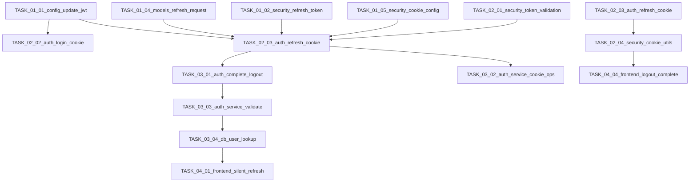

# Task Execution Order - Phase 1

## Overview

This file defines the execution order for Phase 1 (Auth Token Management) tasks. Tasks are ordered to respect dependencies and minimize risk during implementation.

## Execution Groups

### Group 1: Infrastructure Setup (Tasks 1-5)
**Duration**: 1-2 hours
**Dependencies**: None
**Parallel Execution**: Partially (Tasks 1, 4 independent)
**Rollout Safety**: High - foundational changes

**Execution Order**:
1. **TASK_01_01_config_update_jwt** - Update JWT configuration
2. **TASK_01_04_models_refresh_request** - Remove RefreshRequest model
3. **TASK_01_02_security_refresh_token** - Add refresh token creation
4. **TASK_01_05_security_cookie_config** - Configure cookie security
5. **TASK_01_03_auth_logout** - Create logout endpoint structure

### Group 2: Security & Token Logic (Tasks 6-9)
**Duration**: 2-3 hours
**Dependencies**: Group 1 completed
**Parallel Execution**: Limited
**Rollout Safety**: Medium - security-critical changes

**Execution Order**:
1. **TASK_02_01_security_token_validation** - Token validation function
2. **TASK_02_02_auth_login_cookie** - Login with cookie
3. **TASK_02_03_auth_refresh_cookie** - Cookie-based refresh
4. **TASK_02_04_security_cookie_utils** - Cookie utility functions

### Group 3: Backend API Implementation (Tasks 10-13)
**Duration**: 2-3 hours
**Dependencies**: Group 2 completed
**Parallel Execution**: Limited
**Rollout Safety**: Medium - API changes

**Execution Order**:
1. **TASK_03_01_auth_complete_logout** - Complete logout implementation
2. **TASK_03_02_auth_service_cookie_ops** - AuthService updates
3. **TASK_03_03_auth_service_validate** - Add validation method
4. **TASK_03_04_db_user_lookup** - Database lookup integration

### Group 4: Frontend Integration (Tasks 14-17)
**Duration**: 3-4 hours
**Dependencies**: Group 3 completed
**Parallel Execution**: Limited
**Rollout Safety**: Medium - frontend changes

**Execution Order**:
1. **TASK_04_02_frontend_refresh_api** - Refresh API function
2. **TASK_04_01_frontend_silent_refresh** - Silent refresh implementation
3. **TASK_04_03_frontend_request_queue** - Request queuing
4. **TASK_04_04_frontend_logout_complete** - Logout API integration

### Group 5: Validation & Testing (Tasks 18-20)
**Duration**: 2-3 hours
**Dependencies**: All previous groups completed
**Parallel Execution**: Maximum
**Rollout Safety**: High - validation phase

**Execution Order**:
1. **TASK_05_01_backend_auth_tests** - Backend tests
2. **TASK_05_02_frontend_token_tests** - Frontend tests
3. **TASK_05_03_e2e_auth_flow** - End-to-end validation

## Safety Gates

### Pre-Implementation Checks
- [ ] Group 1: All configuration changes validated
- [ ] Group 2: Security functions reviewed and approved
- [ ] Group 3: API contracts verified
- [ ] Group 4: Frontend integration tested separately

### Post-Implementation Validation
- [ ] All tests passing locally
- [ ] Security scan completed (no vulnerabilities)
- [ ] Performance testing completed
- [ ] Manual end-to-end validation passed

## Rollout Strategy

### Staged Rollout Recommendation
1. **Development**: Complete Group 1-3, deploy to staging
2. **Staging**: Complete frontend integration (Group 4), comprehensive testing
3. **Production**: Gradual rollout with monitoring
4. **Rollback**: Plan in place, rollback within 5 minutes if critical issues

### Monitoring Points
- **API Response Times**: Monitor for degradation during refresh operations
- **Authentication Success Rate**: Track % of successful logins and refreshes
- **Error Rates**: Monitor 401/403/500 rates specifically for auth endpoints
- **Memory Usage**: Check for memory leaks in request queuing

### Rollback Criteria
- Authentication failure rate > 5%
- Refresh token failure rate > 10%
- Any security-related alerts
- Performance degradation > 20%

## Task Dependencies Matrix

## Risk Assessment

### High Risk Tasks
- **TASK_02_03_auth_refresh_cookie**: Security implications of cookies
- **TASK_04_01_frontend_silent_refresh**: User experience impact
- **TASK_05_03_e2e_auth_flow**: Complete system integration

### Mitigation Strategies
- **Code Reviews**: Mandatory for all high-risk tasks
- **Incremental Testing**: Test each change in isolation
- **Rollback Plan**: Prepared for each major change
- **Monitoring**: Enhanced monitoring during rollout

## Success Metrics

### Technical Metrics
- **Authentication Success Rate**: > 99.9%
- **Refresh Success Rate**: > 99.5%
- **Token Expiration Handling**: < 1% failure rate
- **Performance Impact**: < 10% degradation

### Security Metrics
- **XSS Exposure**: 0% - No client-side token storage
- **Cookie Security**: 100% - All cookies have correct attributes
- **Rate Limiting**: Maintained at existing levels

### User Experience Metrics
- **Login Time**: Unchanged
- **Page Refresh Auth**: 100% success
- **Logout Functionality**: 100% success
- **Error Visibility**: Graceful, informative errors

## Communication Plan

### Team Notifications
1. **Pre-Start**: Notify team of Group 1 start
2. **After Group 1**: Report completion and next steps
3. **After Group 3**: Security review checkpoint
4. **After Group 5**: Final validation report

### Stakeholder Updates
- **Daily**: Progress updates during implementation
- **Completion**: Summary report with metrics
- **Issues**: Immediate notification for critical problems

## Action Items for Implementation

1. **Week 1**: Complete Group 1 (Config & Models)
2. **Week 2**: Complete Group 2 (Security & Token Logic)
3. **Week 3**: Complete Group 3 (Backend Implementation)
4. **Week 4**: Complete Group 4 (Frontend Integration)
5. **Week 5**: Complete Group 5 (Testing & Validation)

## References

- [Phase Requirements](<MAIN_CONTEXT>)
- [Locked Decisions](<DECISION_CONTENT>)
- [Research Content](<RESEARCH_CONTENT>)
- [Project Specification](C:\py_dev\mkobi\docs\SPEC.md)
- [Agent Guidelines](C:\py_dev\mkobi\AGENTS.md)